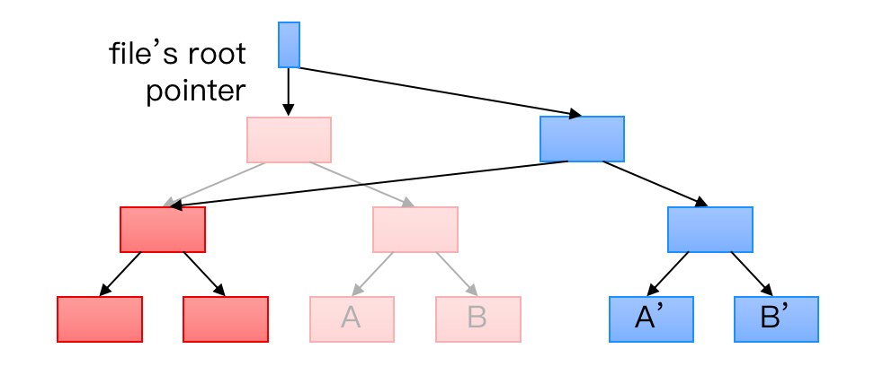
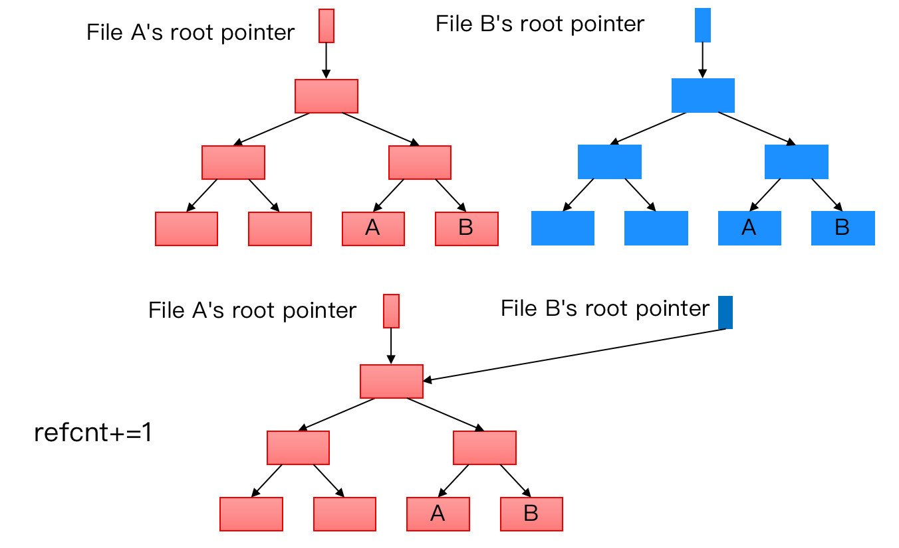
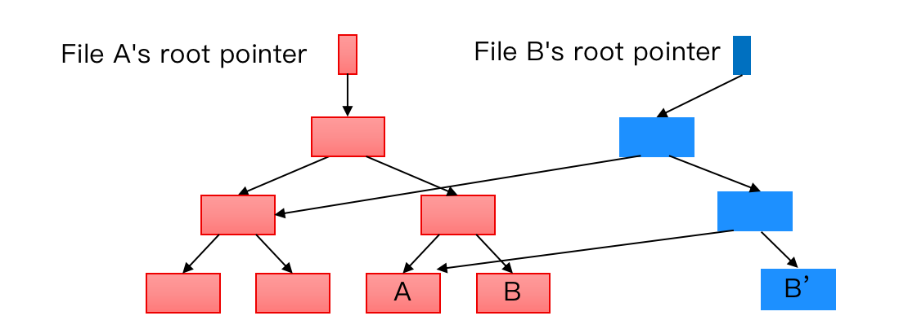
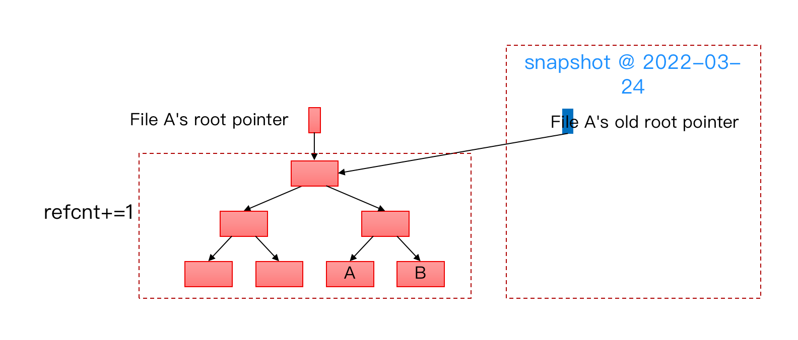

>  ## 一些文件系统设计考量

> ### XFS 使用Direct I/O

其实目前许多文件系统都是默认采用buffer I/O，对于read和write操作，首先作用操作系统内核的page cache，操作系统再定期将page cache刷到磁盘上，这样大大减少频繁 I/O 读写磁盘的次数，提高了读写速度。

而XFS考虑Large、Sparse Files的情况，会采用Direct I/O的方法，而使用这种方法主要考虑两个方面：

1. 对于大文件，采用buffer I/O 会在内存多复制一份数据，占用过多内存资源，比如虚拟机镜像，日志文件等
2. 许多数据库自己会管理cache，page cache不一定符合数据库想要的cache规则，数据库会考虑SQL语句去设计cache。

>  ### Btrfs的Copy-on-Write 

Btrfs是一个基于Copy-on-Write B-tree的文件系统。

其巧妙之处在于：

1. 原子操作的更新

   

   文件更新前先将更新后的部分的子树建好，此时对于文件来说，只需改变root指针指向的block就可以决定是否已经完成更新，而不会出现crash导致更新到一半的情况。

2. 拷贝文件便捷

   拷贝文件时只需要让文件对应指针指向存储的文件，然后在refcnt上加1即可，主要是一些系统说自己可以迅速拷贝大文件的处理方式，其实并没有对文件在创建一份，而与其他不同的是，在文件B修改的时候（文件A不应该看到B的修改），并不是再创建一份文件，而是通过以下方法（比如修改了block B）：

   

   这样可以减少修改文件带来的磁盘开销。

3. 非常适合快照设计

   比如

> ###  等待补充

​     

​	