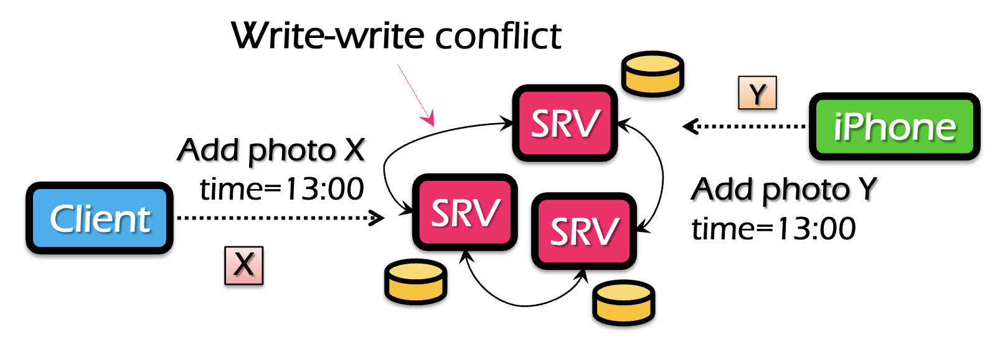
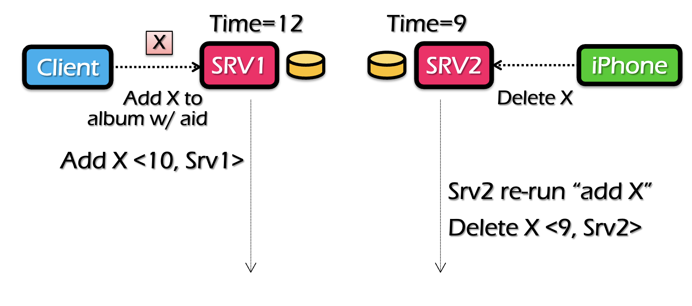
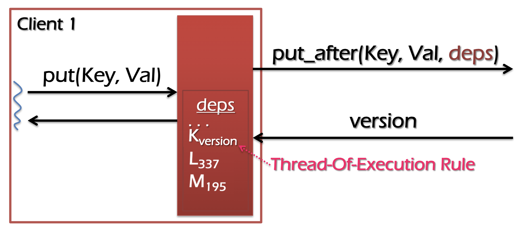
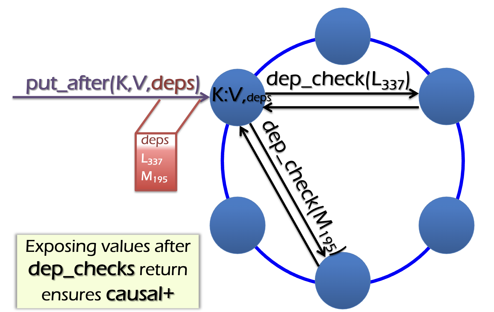
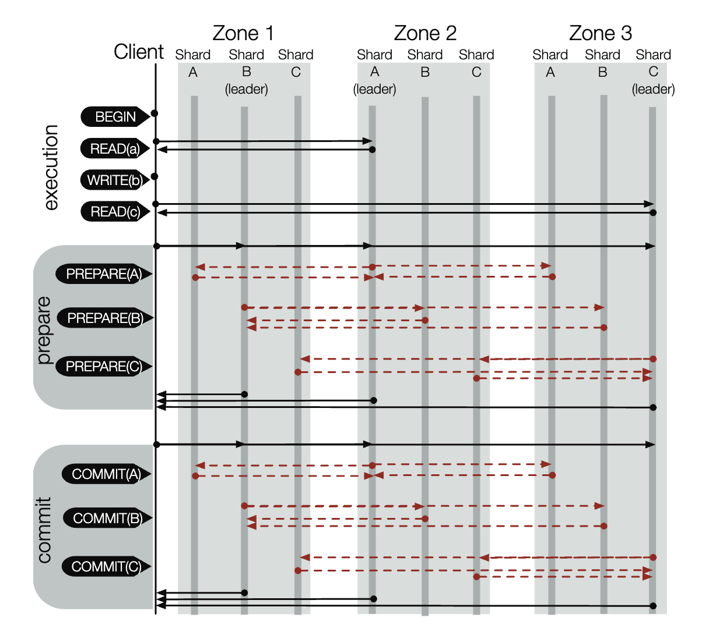
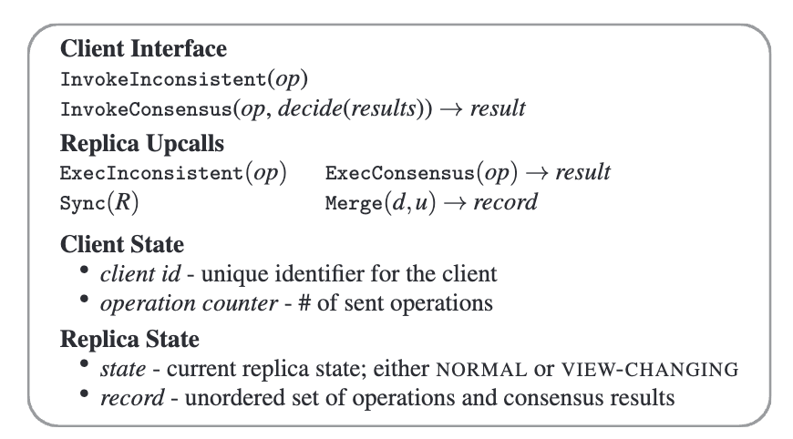
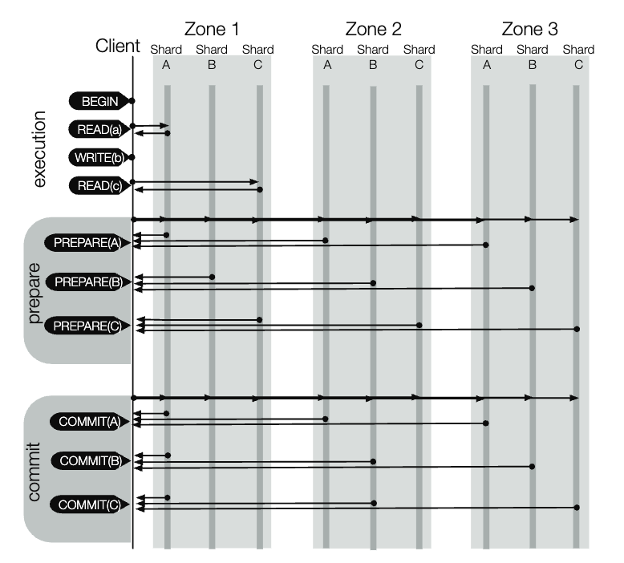

最近上分布式与并行系统课有感，根据课上内容加以总结。

> ### 一致性模型

一致性模型并没有绝对正确或错误的，而是在易于编程性和效率之间的权衡

在分布式系统中实现一致性的挑战：

- 数据复制（缓存） 
- 并发（无共享时钟）
- 故障（机器或网络）

> ### 常见一致性

**顺序一致性(Sequential consistency)**：保证每个人都看到相同的读写顺序，所有读/写操作都遵循某种总排序，且读操作获取最新的写操作结果

**发布一致性(Release consistency)**：每个人都按锁的释放顺序看到写入

两种一致性的缺点：

1. 速度非常慢，每次操作前必须询问，顺序一致性每次读写操作需要询问主控，而发布一致性需要询问锁管理器是否可以获取或释放锁。要求高可用的连接，核心管理器不能挂。

2. 不适合某些特定场景，比如客户端断开连接时会影响一致性；购物车等应用程序可能更关注可用性，而允许不影响关键服务的不一致；地理位置较远的应用程序。

>  ### 最终一致性方案：Bayou

**论文：Managing Update Conflicts in Bayou, a Weakly Connected Replicated Storage System (SOSP’95)**

最终一致性目标：更好的性能，确保：	

1. 在对数据排序之前能够接受写入 
2. 读取可能会返回旧值，但不会阻塞直到最新值出现

可能出现的问题：

1. 写写冲突

2. 读取丢失因果关系的旧值

举个例子，有个照片应用拥有保存各用户上传照片的数据库，该应用允许用户增删照片。首先该数据库通过分布式的server集群进行多备份保存，从而防止某台机器crash导致数据完全丢失的情况。

在这种情况下，同个用户的电脑client端和手机端同时传不同的照片，就会出现写写冲突，即不同的服务器对于这两张照片的出现顺序可能不同。

对于这种情况，Bayou提出采用update函数，其读取存储的当前状态，决定正确的更改顺序，通过有序更新日志，来确保两个节点在日志中具有相同的更新。

其设计为Update ID：<时间 T，节点 ID> ，其由创建update函数的节点分配。

对update函数X和Y执行顺序的规则为：X < Y iff (X.T < Y.T) 或 (X.T=Y.T 且 X.ID < Y.ID)

而对于时钟时间，如果不同机器的时钟不同是否会对更新顺序一致性产生影响？

比如client在SRV1时钟为10的时候创建一个添加图片的操作，而SRV2得到同步后手机执行删除图片的操作，这时候对于SRV2来说其时钟为9，那么SRV1同步时就会出现删除不存在资源的操作。

论文给出解决方案：

使用Lamport 逻辑时钟：

1. 每个服务器都保留一个时钟 T 
2. 根据实际时间的推移，每秒递增 T一秒
3. 如果从另一台服务器其时钟 T’，则修改 T = Max(T, T’+1)

就刚才上述情景，SRV2同步SRV1的操作后看到T’为10，所以会更新T=Max(T, 10+1)=11，所以删除操作的时间会变为13。

接着又会有问题，对于一些图片，在某台服务器上执行的更新与其他服务器发来的更新冲突，此时服务器发现在自己的更新操作前还执行了一堆更新而没有同步，此时的冲突需要大量的回滚，而它不知道要回滚多少，所以要通过完整的log记录来重新执行更新，这样会时操作变得复杂。

所以论文提出指定一台服务器指定为主服务器，通过其确定总的分配提交顺序，使用全局的CSN（Commit Sequence Number）加入时间戳：<CSN, local-TS, SrvID> ，对于任何具有CSN 的写入均认为是stable的，这些stable的写入不会被回滚，而且CSN 定义提交更新的总顺序，可以在服务器之间交换。

> ###广域存储下的因果一致性：COPS

论文：COPS: Scalable Causal Consistency for Wide-Area Storage

这里说明一下因果一致性：

1. 如果有 op1 和 op2 在单个执行线程中，并且 op1 在 op2 之前发出，则op1 -> op2 (Thread-of-Execution) 
2. 如果 op2 读取了 op1 写入的结果,则op1 -> op2 (Get-from）
3. 如果op1 -> op2, 且op2 -> op3，则op1 -> op3 （Transitivity）

COPS主要针对于广域存储，不同地区通过长距离的链路连接的多个数据中心，这是当前普遍的情况。	其觉得相比之下，Bayou已经实现了Availability、Low Latency 、Partition Tolerance和Causal+ Consistency（即Causal + Conflict Handling），但是Scalability并不佳。而这是由于Log的设计导致的，原因如下：

1. 日志是单一的序列化，其隐式获取并强制执行因果顺序。 
2. 一个节点存储所有内容，为集群中的所有操作提供日志，大大限制可扩展性。
3. 对于跨区的站点，并不存在因果关系。

而论文认为实现Scalability的关键在于通过元数据显式获取因果关系，通过分布式验证取代单一序列化，通过显式的依赖性传播来同步因果关系，比如：站点 A 执行写入，将该写入与其依赖关系一起复制到另一个站点 B，则站点 B 会先等待，直到写入的依赖性均满足，然后再提交该写入。

比如当client1存数据时，其本地会保存一个依赖关系deps，其会向服务器发送put_after请求会带deps参数，然后会返回一个Key的版本保存在deps中，通过版本号来体现Thread-of-Execution的规则，而除此之外由于Get-from和Transitivity原则还需要另外两个依赖，当put_after操作发到服务器时，会先检查这些依赖，只有满足这些依赖才能写入数据。而当所有数据中心提交上个的值之后，经过一段时间可以将依赖删除，以避免依赖过多。

COPS 是一个可扩展的分布式存储系统，在不牺牲 ALPS 属性的情况下提供因果+一致性，通过在每个集群中在写入之前检查因果依赖关系是否得到满足，来实现因果+一致性。

> ### TAPIR

TAPIR  使用不一致复制实现事务一致性

#### 动机 

现代分布式存储系统为了支持强一致性的事务，其实现分布式事务协议（确保跨分片事务的原子性和一致性）和复制协议（以确保事务不丢失（前提是事务错误不超过分片的一半）。	

分布式事务协议使用日志来确保有序、容错。但日志实现上述两种协议既需要保证每个分片中副本之间的操作的串行排序，也需要实现跨分片事务的串行排序。这两种复杂操作的集成给存储系统带来严重的性能损失。 

此外，为了保证操作跨副本排序，在事务中引入副本leader，操作会先转到分片领导者。同时prepare和commit阶段除了client端向leader发送请求外，不同分片的leader跨机器的副本进行同步，因此，准备和提交阶段都至少需要两个往返。

#### 不一致性复制

不一致复制 (IR) 是一种高效的复制协议，旨在与更高级别的协议（例如分布式事务协议）一起使用。 IR 提供容错能力，但不强制执行其自身的任何一致性保证。相反，它允许更高级别的协议（我们称为应用程序协议）决定冲突操作的结果，并通过 IR 的容错、无序操作集恢复这些决策

应用程序协议通过 IR 以两种模式之一调用操作：

 • 不一致 – 操作可以按任何顺序执行。成功的操作在失败中依然存在。

 • 共识——操作以任意顺序执行，但返回单一共识结果。成功的操作及其共识结果在失败中仍然存在。

不一致操作类似于弱一致性复制协议中的操作：它们可以在每个副本上以不同的顺序执行，并且应用程序协议必须随后解决冲突。相比之下，共识操作允许应用程序协议决定冲突的结果（通过执行应用程序协议指定的决策函数），并通过确保所选结果在故障中持续作为共识结果来恢复该决策。通过这种方式，共识操作可以作为应用协议更高级别保证的基本构建块。例如，分布式事务协议可以决定提交两个冲突事务中的哪一个，而 IR 将确保该决策在出现故障时持续存在。

论文将成功的操作定义为返回到应用程序协议的操作，而任何IR组的操作集都包括所有成功的操作。而且如果执行操作 Y 的副本之一之前执行过操作 X，我们将操作 X 定义为对操作 Y 可见。IR 确保操作集具有以下属性:

**容错**：任何时候，操作集中的每一个操作在任意一个quorum f+1 个未失败副本的至少一个副本中。 

**可见性**：对于操作集中的任意两个操作，至少有一个操作对另一个操作是可见的。 

**共识结果**：任何时候，成功的共识操作返回的结果在任意一个quorum至少一个副本的记录中。唯一的例外是如果应用协议通过 Merge 显式修改了共识结果，则将记录 Merge 的结果作为替代。 

IR 保证 2f+1 个副本中最多 f 个同时故障以及任意客户端可以随时故障。我们假设一个异步网络，其中消息可能会丢失或乱序传递。 IR 不需要同步磁盘写入，即使客户端或副本因故障而丢失状态，也能维持运行。如果重复重新发送的消息最终在收件人超时之前传递，操作最终会成功。

图 3 显示了客户端和副本的 IR 状态。每个 IR 客户端都保留一个操作计数器，该计数器与客户端 ID 相结合，唯一地标识操作。每个副本都保存已执行操作和共识操作结果的无序记录。副本将不一致的操作作为 TENTATIVE 添加到其记录中，然后在执行后将其标记为 FINALIZED。共识操作首先用本地执行操作的结果标记为 TENTATIVE，然后一旦记录具有共识结果，就标记为 FINALIZED。 IR 使用四个子协议——操作处理、副本恢复/同步、客户端恢复和组成员身份更改。

#### 操作协议

我们首先描述 IR 正常情况下无故障的不一致操作处理协议： 

1. 客户端向所有副本发送<PROPOSE, id, op>，其中 id 是操作 id，op 是操作。 
2.  每个副本将 id 和 op 作为 TENTATIVE 写入其记录，然后用 <REPLY, id> 响应客户端。 
3. 一旦客户端收到来自副本的 f + 1 个响应（必要时重试），它将返回到应用程序协议并异步发送 <FINALIZE, id> 到所有副本。 （ FINALIZE 也可以搭载在客户端的下一条消息上。）
4. 根据情况采用快慢路径，我们在下面描述这两者： 
   1. 客户端向所有副本发送<PROPOSE, id, op>。 
   2.  每个副本使用 ExecConsensus(op) 调用应用程序协议，并将 id、op 和结果作为 TENTATIVE 写入其记录。副本用 <REPLY, id, result> 响应客户端。
   3.  如果客户端收到至少 3/2 f + 1 个匹配结果（在超时内），则采用快速路径：客户端将结果返回给应用程序协议并异步发送 <FINALIZE, id, result>到所有副本。 
   4. 否则，客户端将采用慢速路径：一旦收到 f +1 个响应（必要时重试），则将 <FINALIZE, id, result> 发送到所有副本，其中结果是通过执行决策获得的。 
   5. 收到 FINALIZE 后，每个副本将操作标记为 FINALIZED ，如果收到的结果不同则更新其记录，并向客户端发送 <CONFIRM, id> 。 
   6. 在慢速路径上，客户端在收到 f + 1 个 CONFIRM 响应后将结果返回给应用协议。共识操作的快速路径需要到 3 2 f + 1 个副本的单次往返，而慢速路径需要到至少 f + 1 个副本的两次往返。请注意，IR 副本可以按不同的顺序执行操作，并且仍然返回匹配的响应，因此 IR 可以使用快速路径，而无需跨副本的操作进行严格的串行排序。 IR 还可以并行运行快速路径和慢速路径作为优化

#### 副本恢复与同步

IR 使用单一协议来恢复失败的副本并运行定期同步。为了处理恢复和同步，我们将视图更改引入到 IR 协议中，类似于 Viewstamped Replication (VR) [37]。

**视图更改:**

- 当检测到副本故障或网络分区时，将触发视图更改协议。
- 选举出一个新的主节点（通常是编号最高的活动副本）。
- 新视图号增加。
- 副本交换其状态信息以确保在新视图中保持一致性。

每次 IR 视图变更均由领导者负责；领导者仅协调视图更改，而不协调操作处理。在视图更改期间，领导者只有一项任务：使至少 f + 1 个副本保持最新（即，它们已应用操作集中的所有操作）并且彼此一致（即，它们已应用相同的共识结果）。 IR 视图更改需要领导者，因为轮询不一致的副本可能会导致操作集和共识结果发生冲突。因此，领导者必须决定一个主记录，然后副本可以使用该主记录来相互同步。

为了支持视图更改，每个 IR 副本都维护一个当前视图，其中包含领导者的身份、组中副本的列表以及唯一标识该视图的（单调递增）视图编号。每个 IR 副本可以处于以下三种状态之一：NORMAL、VIEW-CHANGING 或 RECOVERING。

副本进程仅在 NORMAL 状态下进行操作。我们对 IR 的操作处理协议进行了四项补充：

1. IR 副本在每次响应客户端时发送其当前视图编号。为了使操作被视为成功，IR 客户端必须收到具有匹配视图编号的响应。对于共识操作，REPLY 和 CONFIRM 中的视图编号也必须匹配。如果客户端收到具有不同视图编号的响应，它会通知旧视图中的副本。 2. 在接收到视图编号高于其当前视图的消息时，副本将转至 VIEW-CHANGING 状态，并向更高视图中的任何副本请求主记录。它用主记录替换自己的记录，并在返回正常状态之前使用同步向上调用应用程序协议。 3. 在 PROPOSE 上，每个副本首先检查操作是否已通过视图更改完成。如果是，副本会响应 <REPLY, id, FINALIZED, v, [result]>，其中 v 是副本当前的视图编号，result 是共识操作的共识结果。 4. 如果客户端收到共识操作的 FINALIZED 状态的 REPLY，它会发送 <FINALIZE, id, result> 以及收到的结果，并等待，直到在同一视图中收到 f + 1 个 CONFIRM 响应，然后将结果返回给应用程序协议。我们在这里概述视图更改协议；完整的描述可以在我们的 TR [46] 中找到。该协议与 VR 相同，只是领导者必须合并最新视图中的记录，而不是简单地从最新视图中获取最长的日志，以保留 3.1.2 中所述的所有保证。在同步期间，IR 完成所有 TENTATIVE 操作，依靠应用程序协议来决定任何共识结果。一旦领导者收到 f + 1 条记录，它就会使用 IR - MERGE - RECORDS(records) 将最新视图中的副本中的记录合并到主记录 R 中（参见图 5），其中记录是收到的记录集从最高视角的复制品来看。 IR - MERGE - RECORDS 首先将所有不一致的操作和标记为 FINALIZED 的共识操作添加到 R 中，并将 Sync 调用到应用程序协议中。这些操作必须在下一个视图中持续存在，因此我们首先将它们应用于领导者，确保它们对于领导者接下来在合并中决定共识结果的任何操作都是可见的。例如，锁服务器的 Sync 通过 id 匹配所有相应的 Lock 和 Unlock；如果存在不匹配的锁，则设置locked = TRUE；否则，锁定 = FALSE 。 IR 要求应用程序协议决定剩余 TENTATIVE 共识操作的共识结果，其中要么：（1）在至少 f 2 + 1 条记录中具有匹配结果，我们将其定义为多数结果，或者（2）不要。 IR 将这些操作分别放在 d 和 u 中，并将 Merge(d, u) 调用到应用程序协议中，该协议必须为 d 和 u 中的每个操作返回一致的结果。出于多种原因，IR 必须依赖应用程序协议来决定共识结果。对于 d 中的操作，IR 无法判断操作是否成功并获得多数结果是在快速路径上，还是在慢速路径上，应用程序协议会决定不同的结果，但后来会丢失。在某些情况下，IR 保留多数结果并不安全，因为这会违反应用程序协议不变量。例如，在锁服务器中，如果只有 f 2 + 1 个副本回复 OK ，则 OK 可能是多数结果，但其他副本可能接受了冲突的锁请求。但是，其他副本也有可能响应 OK ，在这种情况下 OK 将是快速路径上的成功响应。解决这种歧义的需要是 IR 共识属性 (P3) 中提出警告的原因，即共识结果可以在 Merge 中更改。幸运的是，应用程序协议可以确保成功的共识结果在 Merge 中不会改变，只需在 Merge 中维护 d 中的多数结果，除非它们违反了不变量。因此，锁服务器的合并功能不会更改 OK 的多数响应，除非另一个客户端持有锁。在这种情况下，d 中的操作无法向客户端返回成功的共识结果（无论是通过快速路径还是慢速路径），因此更改其结果是安全的。对于u中的操作，IR需要调用decide，但不能没有至少f + 1个结果，因此使用Merge代替。应用程序协议可以在没有 f + 1 个副本结果的情况下决定 Merge 中的共识结果，并且仍然保留 IR 的可见性属性，因为 IR 已经应用了 R 和 d 中的所有操作，此时它们是操作集中唯一确定的操作。领导者将从 Merge 返回的所有操作及其共识结果添加到 R，然后将 R 发送到其他副本，这些副本将 Sync(R) 调用到应用程序协议中，并用 R 替换自己的记录。至少在 f 后视图更改完成。 + 1 个副本已交换和合并记录并与主记录同步。副本只能在完成视图更改协议后处理新视图（正常状态）中的请求。此时，任何正在恢复的副本也可以被视为已恢复。如果视图更改的领导者在某个超时时间内没有完成视图更改，则该组将选举一个新的领导者，通过启动具有更大视图编号的新视图更改来完成协议

正确性：

 P1表示每一个成功的操作都是持久化的；因为只有从 2 f + 1 个副本中的 f + 1 个副本接收到响应后，操作才会成功。

对于 P2，考虑任意两个成功的共识操作 X 和 Y 。每个收到的候选结果来自执行请求的 f + 1 个副本的法定数量。通过quorum，必须有一个副本同时执行 X 和 Y ；不失一般性地假设它首先执行 X。那么它的 Y 候选结果反映了 X 的影响，并且 X 对 Y 是可见的。

对于 P3，在快速路径上获得了成功的共识操作结果，在这种情况下，快速副本的quorum在其记录中具有标记为“TENTATIVE”的相同结果，或者在慢速路径上获得了成功的共识操作结果，在这种情况下，f + 1 个副本具有结果在他们的记录中标记为“FINALIZED”。在这两种情况下，每个quorum中至少有一个副本将具有该结果。

新视图的领导者合并来自 f + 1 个响应的最高视图中的副本记录。任何持久性操作都会出现在这些记录之一中，并且合并过程确保它保留在主记录中。仅合并来自最高副本的记录就足够了，因为与 VR 类似，IR 的视图更改协议确保参与视图更改的副本不会移动到较低视图，因此任何操作都不会在较低视图中持久化。视图更改通过将至少 f +1 个副本与主记录同步来完成，确保 P1 继续保留。

这也维护了属性 P3：采用慢速路径的共识操作将在至少一条记录中显示为 FINALIZED，而采用快速路径的共识操作将在至少 f /2 + 1 条记录中显示为 TENTATIVE。 IR 的合并过程可确保维护这些操作的结果，除非应用程序协议选择在其合并功能中更改它们。一旦操作在 f + 1 个副本上完成（通过成功的视图更改或客户端），协议将确保共识结果不会更改并将持续存在：在构造时操作将始终显示为 FINALIZED任何后续主记录，因此合并过程将始终同步它。

最后，在视图更改期间维护 P2，因为领导者在调用 Merge 之前首先调用 Sync 与所有先前成功的操作，因此先前成功的操作对于领导者在视图更改期间完成的任何操作都是可见的。然后，视图更改确保任何最终确定的操作将继续在至少 f + 1 个副本的记录中最终确定，从而对后续成功的操作可见。

### TAPIR

TAPIR 设计位于复制事务存储系统中 IR 之上。 TAPIR 和 IR 一起消除了复制事务系统中的冗余。作为比较，图 6 显示了 TAPIR 中相同读写事务所需的协调，具有以下优点：（1）TAPIR没有任何领导者或集中协调，（2）TAPIR读取总是去最近的副本，（3）TAPIR提交在常见情况下对参与者进行单次往返。

TAPIR 旨在为可扩展的存储架构提供分布式事务。该架构将数据划分为多个分片，并在一组存储服务器上复制每个分片。客户端是前端应用程序服务器，位于与存储服务器相同或不同的数据中心，而不是终端主机或用户计算机。

使用 TAPIR 的应用程序不直接与 IR 交互。 TAPIR 应用程序开始事务，然后在事务执行期间执行读取和写入。在此期间，应用程序可以中止事务。一旦完成执行调用 Commit，它就不能再中止事务。 2PC 协议将运行直至完成，提交或中止事务完全取决于参与者的决定。因此，TAPIR 的 2PC 协调器无法做出提交或中止决策，并且不必具有容错能力。此属性允许 TAPIR 使用客户端作为 2PC 协调器以减少到存储服务器的往返次数。 TAPIR 为传统的 ACID 保证提供最严格的隔离级别：已提交事务的严格可串行化。

TAPIR 使用事务处理协议、IR 函数和协调器恢复协议三部分来保证事务正确。图 7 显示了 TAPIR 在客户端和副本上的接口和状态。副本按时间戳顺序在事务日志中保留已提交和中止的事务；它们还实现多版本并发控制，其中对象的每个版本由写入该版本的事务的时间戳来标识。

**事务处理**：

我们从 TAPIR 执行事务开始。

1. 对于 Write(key, object)，客户端缓冲写入集中的 key 和 object，直到提交并立即返回。 

2.  对于Read(key)，如果key在事务的写集中，则客户端从写集中返回对象。如果事务已经读取密钥，则返回缓存的副本。否则，客户端将 Read(key) 发送到副本。

3. 接收到 Read 后，副本会返回对象和版本，其中对象是密钥的最新版本，版本是写入该版本的事务的时间戳。 

4. 响应时，客户端将（密钥，版本）放入事务的读取集中并将对象返回给应用程序。

一旦应用程序调用 Commit 或 Abort，执行阶段就结束。为了提交，TAPIR 客户端协调所有参与者（负责读取或写入集中的键的分片），以找到与事务的严格串行顺序一致的单个时间戳，以分配事务的读取和写入，如下所示如下：  

   1. TAPIR 客户端选择建议的时间戳。建议的时间戳必须是唯一的，因此客户端使用本地时间和客户端 ID 的元组。 
   2. TAPIR客户端调用Prepare(txn, timestamp)作为IR共识操作，其中timestamp是建议时间戳，txn包括交易id(txn.id)和交易读(txn.read set)和写集(txn .写集）。客户端通过 IR 对所有参与者调用“Prepare”作为共识操作。
   3. 接收Prepare（由IR 通过ExecConcensus 调用）的每个TAPIR 副本首先检查其事务日志中的txn.id。如果找到，则返回 PREPARE - OK（如果事务已提交）或 ABORT（如果事务中止）。
   4. 否则，副本会检查 txn.id 是否已在其准备列表中。如果找到，则返回 PREPARE - OK 。
   5. 否则，副本将运行 TAPIR 的 OCC 验证检查，该检查会检查时间戳处与事务的读取和写入集是否存在冲突，如图 8 所示。
   6. 一旦 TAPIR 客户端收到来自所有分片的结果，客户端就会发送 Commit(txn, timestamp) 如果所有分片都回复 PREPARE - OK 或 Abort(txn, timestamp) 如果任何分片回复 ABORT 或 ABSTAIN 。如果任何分片回复 RETRY ，则客户端会使用新的建议时间戳重试（最多重试限制）。
   7. 收到提交后，TAPIR 副本：(1) 将事务提交到其事务日志，(2) 使用 w 更新其版本存储，(3) 从其准备列表中删除事务（如果存在），并且(4) 响应客户端。
   8. 收到中止后，TAPIR 副本：(1) 记录中止，(2) 从其准备列表中删除事务（如果有），以及 (3) 响应客户端。与其他基于 2PC 的协议一样，一旦Prepare从所有分片返回（在步骤6中），TAPIR就可以将事务的结果返回给应用程序，并异步发送Commit操作。因此，使用 IR，TAPIR 可以通过单次往返向所有分片中的所有副本提交事务

**正确性**：

为了证明正确性，我们证明 TAPIR 在每个副本组中出现 f 次故障以及任意数量的客户端故障时仍保持以下属性： 

• 隔离性。已提交事务存在全局线性化排序。

• 原子性。如果事务在任何参与分片上提交，则它会在所有分片上提交。 

• 耐用性。已提交的事务保持已提交状态，保持原始的可线性化顺序。

**IR支持：**

由于 TAPIR 的prepare是 IR 共识操作，因此 TAPIR 必须实现DECIDE函数：如果大多数副本回复 PREPARE - OK ，则它会执行提交事务。TAPIR 还支持MERGE和副本同步。MERGE 首先从prepare操作为 TENTATIVE 的领导者中删除所有准备好的事务。此步骤消除了领导者可能存在的任何不一致，因为它与组的其他成员以不同的方式执行了prepare（无序或错过）。下一步检查 d 是否有可能在 IR 快速路径上成功并需要保留的任何 PREPARE - OK 结果。如果事务尚未提交或中止，我们重新运行 TAPIR - OCC - CHECK 以检查与其他先前prepare或commit的事务是否存在冲突。如果事务冲突，那么我们知道它的 PREPARE - OK 在快速仲裁中没有成功，因此我们可以将其更改为 ABORT ；否则，为了正确性，我们必须保留 PREPARE - OK，因为 TAPIR 可能已进入 2PC 的提交阶段。此外，我们知道保留这些 PREPARE - OK 结果是安全的，因为如果它们与另一个事务冲突，冲突的事务一定已经在 IR 慢路径上获得了共识结果，所以如果 TAPIR - OCC - CHECK 没有得到一致结果发现冲突，那么冲突事务的Prepare一定没有成功。最后，对于 u 中的操作，我们只需确定每个操作的结果并保存它。我们知道领导者现在与f + 1个副本保持一致，因此它可以根据大多数人的共识结果做出决定。 TAPIR 的同步功能（在其他副本上运行，以协调 TAPIR 状态与主记录，纠正错过的操作或副本与组不一致的共识结果。它只是将操作和共识结果应用于副本的状态：它记录中止和提交，并在组响应 PREPARE - OK 的情况下准备未提交的事务

**协调器恢复**：

如果客户端在提交事务的过程中失败，TAPIR 将确保事务运行完成（提交或中止）。此外，客户端可能已将提交或中止返回给应用程序，因此我们必须确保保留客户端的提交决策。为此，TAPIR 使用 Bernstein [6] 定义的协作终止协议来进行协调器恢复，并由 MDCC [22] 使用。 TAPIR 将参与者分片之一指定为备份分片，其中的副本可以在客户端发生故障时充当备份协调器。正如 MDCC 所观察到的，由于协调器不能单方面中止事务（即，如果客户端收到来自每个参与者的 f + 1 PREPARE - OK 响应，则它必须提交事务），因此备份协调器可以安全地完成协议而不会阻塞。但是，我们必须确保事务的两个协调器不会同时处于活动状态。为此，当备份分片中的副本注意到协调器故障时，它会启动 Paxos 轮次以选举自己作为新的备份协调器。这个副本充当提议者；接受者是备份分片中的副本，学习者是交易的参与者。一旦本轮 Paxos 结束，参与者将仅响应来自新协调者的“准备”、“提交”或“中止”，而忽略来自任何其他协调者的消息。因此，新的备份协调器阻止原始协调器和任何先前的备份协调器随后做出提交决定。我们的技术报告[46]中描述了完整的协议。

**原子性**：

如果事务在任何参与分片上提交，TAPIR 客户端必须已从每个参与分片上收到成功的 PREPARE - OK。除非失败，否则它将确保 Commit 最终在每个参与者处成功执行。 TAPIR 副本始终执行 Commit，即使它们没有准备事务，因此如果 Commit 在一个参与者处执行，则最终会在每个参与者处提交事务。如果协调器发生故障并且事务已经在一个分片上提交，则备份协调器将在协作终止协议的轮询阶段看到提交，并确保提交最终在其他分片上成功执行。如果还没有分片执行 Commit，Paxos 轮将确保所有参与者停止响应原始协调器，并从新的备份协调器获取提交决定。通过归纳，如果新的备份协调器将 Commit 发送到任何分片，它或另一个备份协调器将看到它并确保 Commit 最终在所有参与者上执行