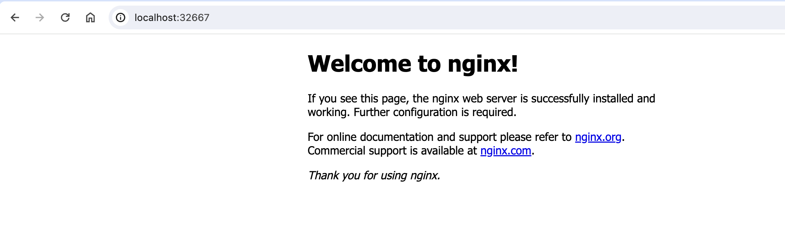

> ## 在pod中的sidecar容器部署envoy作为代理转发

如官方文档所说，Envoy 是一个独立进程，伴随每个应用服务运行。所有的 Envoy 形成一个透明的通信网格，每个应用与 localhost 收发信息，对网络的拓扑结构无感知。这么看envoy的功能其实和nginx类似。

而在k8s中，我简单尝试类似istio的做法，在pod中创建一个sidecar容器来管理其他容器的端口服务代理。

### 创建包含sidecar的pod

```
apiVersion: v1
kind: Pod
metadata:
  name: my-pod
  labels:
    app: my-app
spec:
  containers:
  - name: main-container
    image: nginx:latest
  - name: sidecar-container
    image: envoyproxy/envoy-dev:latest
    ports:
    - containerPort: 9092
    volumeMounts:
    - name: envoy-config
      mountPath: /etc/envoy/envoy.yaml
  volumes:
    - name: envoy-config
      hostPath:
        path: /config/samples/sidecar/configmap.yaml
```

如配置文件所示，主要运行的容器是main-container，在里面跑个nginx，其服务默认端口为80，而另一个运行的容器作为sidecar，在里面运行envoy，并将envoy所需的文件挂载到里面。

### envoy的配置文件信息

下面的文件即为上述envoy所要挂在的配置文件：

```
admin:
  access_log_path: /tmp/admin_access.log
  address:
    socket_address: { address: 0.0.0.0, port_value: 9901 }
static_resources:
  listeners:
  - name: listener_0
    address:
      socket_address: { address: 0.0.0.0, port_value: 9092 }
    filter_chains:
    - filters:
      - name: envoy.filters.network.http_connection_manager
        typed_config:
          "@type":    type.googleapis.com/envoy.extensions.filters.network.http_connection_manager.v3.HttpConnectionManager
          stat_prefix: ingress_http
          codec_type: AUTO
          route_config:
            name: local_route
            virtual_hosts:
            - name: local_service
              domains: ["*"]  
              routes:
              - match: { prefix: "/" }
                route: 
                  cluster: targetCluster
          http_filters:
            - name: envoy.filters.http.router
              typed_config:
                "@type": type.googleapis.com/envoy.extensions.filters.http.router.v3.Router
  clusters:
  - name: targetCluster
    connect_timeout: 0.25s
    type: STRICT_DNS
    dns_lookup_family: V4_ONLY
    lb_policy: ROUND_ROBIN
    load_assignment:
      cluster_name: service
      endpoints:
      - lb_endpoints:
        - endpoint:
            address:
              socket_address:
                address: 127.0.0.1
                port_value: 80   
```

配置文件里的主要内容：

​	`admin`：这部分是去配置Envoy 提供的管理视图，方便我们查看 Envoy 的相关内容。

​	`static_resources`： 包含了 Envoy 启动时静态配置的一切资源，在这里包括`listeners`和`clusters`两部分内容。

​	`listener`：监听器，主要描述具体监听的端口、转发的路由配置以及filter的配置，这里的filters和http_filters采用的是官方文档提供	的示例，监听的是对外暴露的9092端口，并在route_config中进行配置，转发给targetCluster，从配置文件的命名中可以看出，Envoy	希望作为集群的代理服务，配置集群内外的访问，而在本实验则是将其作为pod的代理服务。

​	`clusters`：clusters里面描述了转发的各目标集群，每个集群是某类服务接口的集合，可以做负载均衡，配置访问规则，这里采用的方式为ROUND_ROBIN，在Envoy中，`lb_endpoints`字段用于指定负载均衡器应路由流量到的端点列表，当我们要增加负载均衡的节点时，在`lb_endpoints`下新创建一个`endpoint`来描述即可，这里展示的配置文件只有一个`endpoint`，就是nginx的服务端口。

### 实际运行

部署到k8s集群后，curl pod的9092端口即可获取nginx的内容，不过为了使用浏览器看到更直观的效果，我写了svc将端口映射到服务器的端口上，并转发到我本地机器的端口上，可以成功查看到nginx的界面，在pod中nginx的容器并未对外暴露80端口，而是通过sidecar转发出来。	



在这之后可以通过sidecar来对pod里面的服务流量进行一系列的监控与处理。

### 参考文档

[Envoy官方文档](https://cloudnative.to/envoy/index.html)