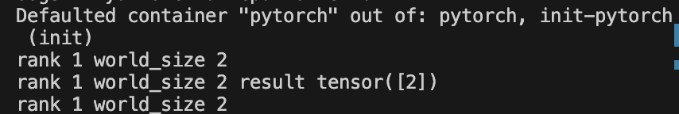
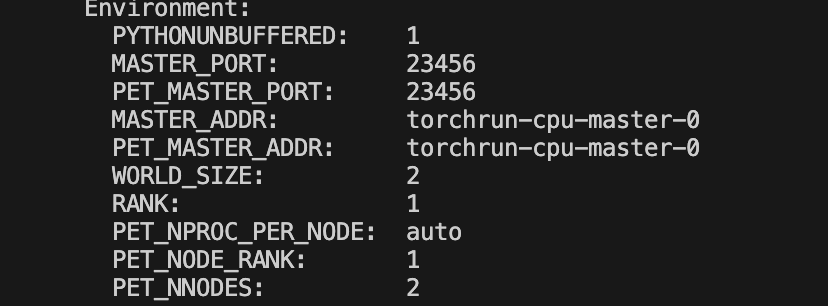
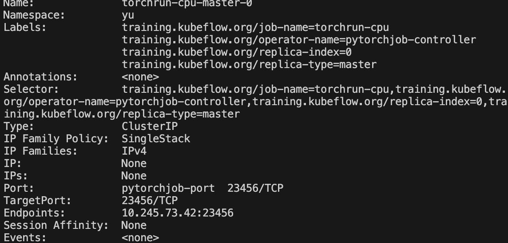

> ## 集群配置

在k8s集群安装stable版training-operator：

```
kubectl apply -k "github.com/kubeflow/training-operator/manifests/overlays/standalone?ref=v1.7.0"
```

下载Kubeflow training-operator对应的Python SDK：

```
pip3 install kubeflow-training
```

> ## 简单的pytorch CPU分布式测试

demo.py文件内容如下：

```
import datetime
import torch
torch.distributed.init_process_group(init_method="env://",timeout=datetime.timedelta(minutes=1))
rank = torch.distributed.get_rank()
world_size = torch.distributed.get_world_size()
print(f"rank {rank} world_size {world_size}")
a = torch.tensor([1])
torch.distributed.all_reduce(a)
print(f"rank {rank} world_size {world_size} result {a}")
torch.distributed.barrier()
print(f"rank {rank} world_size {world_size}")
```

Dockerfile文件如下：

```
FROM python:3.8

RUN pip3 install torch torchvision torchaudio --index-url https://download.pytorch.org/whl/cpu

WORKDIR /

COPY demo.py demo.py
```

打包好镜像上传后，便可以在集群中跑pytorchjob，pytorch.yaml部署文件如下：

```
apiVersion: "kubeflow.org/v1"
kind: PyTorchJob
metadata:
  name: torchrun-cpu
spec:
  pytorchReplicaSpecs:
    Master:
      replicas: 1
      restartPolicy: OnFailure
      template:
        spec:
          containers:
            - name: pytorch
              image: pytorch-demo
              command:
                - "python3"
                - "demo.py"
    Worker:
      replicas: 1
      restartPolicy: OnFailure
      template:
        spec:
          containers:
            - name: pytorch
              image: pytorch-demo
              command:
                - "python3"
                - "demo.py"
```

执行命令开始部署：

```
kubectl apply -f pytorch.yaml -n namespace
```

正常运行结束后可以看到两个pod均为complete状态，查看log输出：



> ## training-operator的一些设计

当我们通过training-operator创建对应的pod资源时，describe worker可以看到如下的env信息：



可以看到master默认端口为23456，world_size即总共的运行节点为2，该worker对应的rank为1，master的地址为master的pod的name，这其实是training-operator为它创建了对应的svc，查看svc可以看到与pod同名的svc：



通过svc配置worker到master pod的tcp连接，以便在distributed.init_process_group以及接下来参数同步等需要网络传输的操作能够正常进行。

而training-operator通过解析yaml文件来为部署的pod配置环境变量以便init_process_group时不用自己配置分布式训练的参数，而是直接读取env配置好的参数，可以简化开发者的开发难度。不过这也能看出来，training-operator对pytorch分布式的支持实际上也是基于pytorch原有的pytorch分布式框架进行开发，在operator上添加相关代码给予支持。